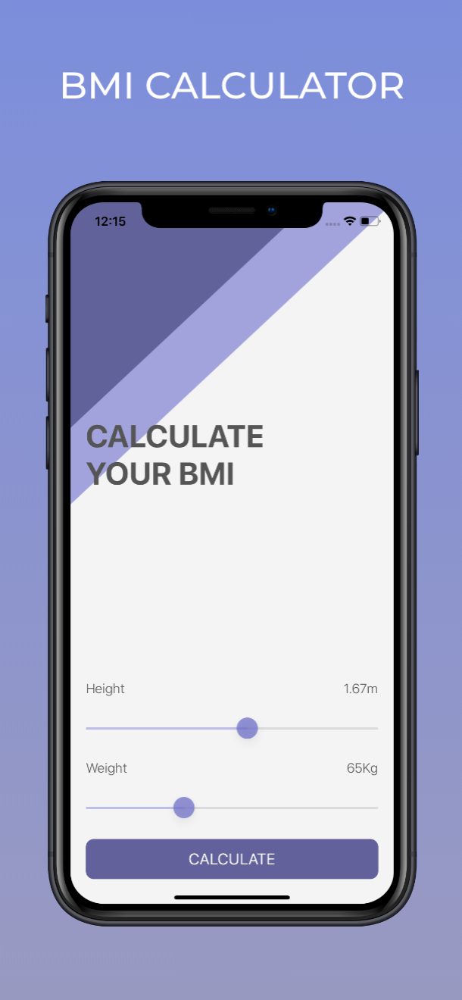
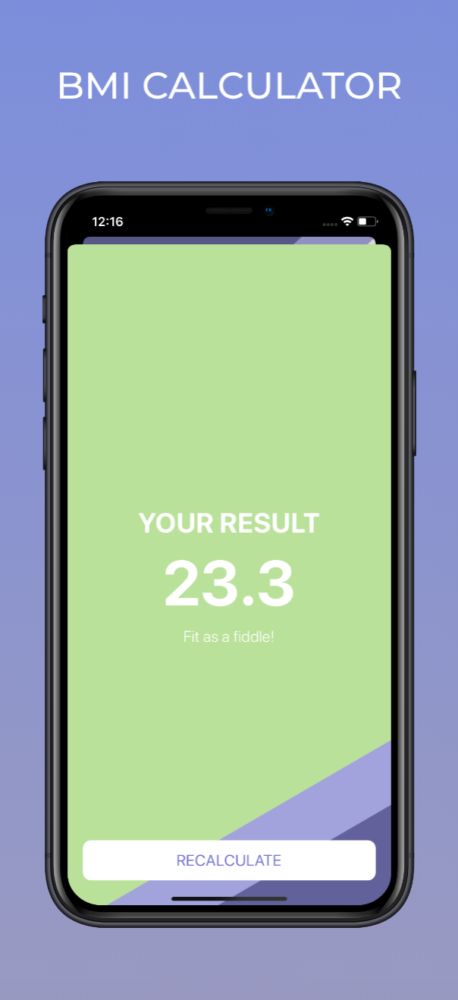

# BMI Calculator
> Body Mass Index calculator. Based on the user’s weight and height it will calculate their body mass and give a piece of health advice depending on whether if they have eaten too many pies or if they need to eat more pies. 

* Swift classes
* Optionals
* Multi-screen app
* Color literals
* UISlider
* Storyboard segues
